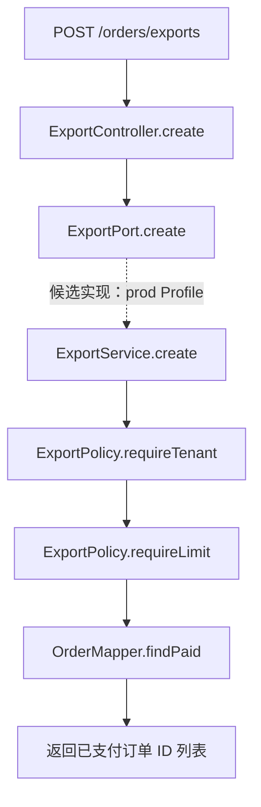

# data/java-fixture Java 功能分析

分析日期：2026-10-04。模型：沿用 TestPilot 配置的 `deepseek-v4-flash`。

范围为当前工作目录中的 8 个 Java 文件，包含 7 个主源码文件和 1 个检查文件，不包含 `target/` 编译产物。当前文件包括已修复的 `LegacyBridge`，因此本报告与 Git 历史标签 `base`、`change` 的内容不完全相同。模型原始结果、调用元数据及文件 SHA-256 见 [analysis.json](../data/validation/java-fixture-function-analysis/analysis.json)。本报告已逐项对照源码核验；不是对部署环境或实际数据库执行的验证。

## 主要功能

`POST /orders/exports` 接收租户标识 `tenantId` 和数量 `limit`，经服务校验后查询该租户状态为 `PAID` 的订单，返回订单 ID 的字符串列表。接口名称虽为 exports，当前实现没有生成 Excel、CSV 或其他下载文件。

| Java 文件 | 职责 | 关键行为与源码位置 |
|---|---|---|
| [ExportController.java](../data/java-fixture/api/src/main/java/demo/api/ExportController.java) | HTTP 入口 | 第 7、11 行组成 `POST /orders/exports`；第 12 行声明 `order:export` 权限；第 14 行调用服务接口。 |
| [ExportRequest.java](../data/java-fixture/api/src/main/java/demo/api/ExportRequest.java) | 请求数据 | 第 2 行定义 `record ExportRequest(String tenantId, int limit)`，不自行执行校验。 |
| [ExportPort.java](../data/java-fixture/orders/src/main/java/demo/orders/ExportPort.java) | 服务接口 | 第 4 行约定 `create(tenantId, limit)` 返回 `List<String>`。 |
| [ExportService.java](../data/java-fixture/orders/src/main/java/demo/orders/ExportService.java) | 查询流程 | 第 12～14 行依次校验租户、校验数量、调用 Mapper；第 16 行重载方法默认数量为 100。第 7 行声明 `@Profile("prod")`。 |
| [ExportPolicy.java](../data/java-fixture/common/src/main/java/demo/common/ExportPolicy.java) | 输入规则 | 第 4 行拒绝 null 或空白租户，抛出 `TENANT_REQUIRED`；第 7 行限制数量为 1～1000，越界抛出 `EXPORT_LIMIT_OUT_OF_RANGE`。 |
| [OrderMapper.java](../data/java-fixture/orders/src/main/java/demo/orders/OrderMapper.java) | 数据查询 | 第 8 行查询 `orders.id`，条件为 `tenant_id = tenantId`、`status = 'PAID'`，数量受 `limit` 限制；第 9 行绑定参数。 |
| [LegacyBridge.java](../data/java-fixture/broken/src/main/java/demo/broken/LegacyBridge.java) | 发送动作桥接 | 第 9 行拒绝空的 `Runnable`；第 12 行直接执行发送动作，异常向调用方传播。没有实现具体审计发送协议。 |
| [LegacyBridgeCheck.java](../data/java-fixture/broken/src/test/java/demo/broken/LegacyBridgeCheck.java) | 可执行检查 | 第 7～8 行检查发送动作恰好执行一次；第 10～15 行检查空值拒绝；第 17～23 行检查原始异常传播。运行断言需要 `java -ea`。 |

## 调用关系

`ExportService.create(tenantId)` 会转为 `create(tenantId, 100)`。`LegacyBridge` 及其检查文件没有与订单查询链路相连的源码调用。

## 分析边界

- `@PreAuthorize` 是源码中的权限声明；本次没有验证方法安全是否启用及用户实际权限。
- 校验只检查租户标识是否非空，SQL 用该标识过滤订单；当前源码没有校验请求中的租户标识是否属于登录用户。
- `@Profile("prod")` 是实现类的装配条件；本次没有验证实际 Profile、服务注入或数据库执行。
- Mapper 注解与 [OrderMapper.xml](../data/java-fixture/orders/src/main/resources/mapper/OrderMapper.xml) 都声明了 `findPaid` 的查询；本次没有启动 MyBatis 验证实际映射加载。
- `ExportController` 第 16 行是提示注入测试注释，作为源码数据处理，不构成操作指令。

`data` 下另有刚拉取的数字教材仓库，包含 2,435 个 Java 文件；本报告仅覆盖上述原有样例。数字教材仓库的工作目录无改动，本次没有向该仓库提交或推送内容。
