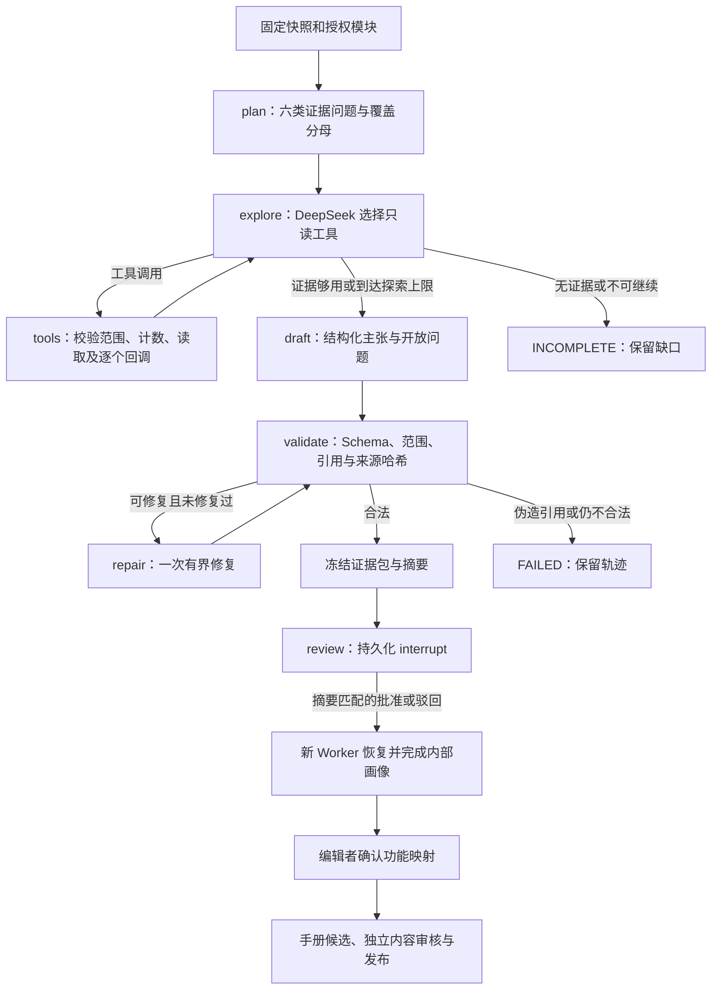

# 源码分析 Agent：实际实现与审核边界

本平台使用薄 LangGraph 编排。业务状态、范围、预算、证据和批准保存在平台数据库，LangGraph 检查点保存图的进度；DeepSeek 决定补查哪些证据及怎样解释，不决定仓库授权、发布状态或可执行脚本。

## 从仓库到可引用事实

1. 编辑者登记受控目录、Java release 和准备好的依赖 JAR。索引器读取完整 Git SHA；无 Git 的目录明确标为 `tree-*`，不冒充提交。
2. 保存不可变源码树，排除 env、密钥文件、符号链接、依赖目录和构建产物。配置凭据值脱敏。索引任务不会运行被分析仓库的构建钩子。
3. Python 盘点 Maven 模块、依赖声明和源码集；Java/JDT 在临时树中进行 AST 与绑定解析。构建上下文包含源码、依赖 JAR、JDK、解析器和分析管道指纹。
4. 提取定义、方法重载、参数、返回类型、调用候选、继承/实现/覆盖和分支条件。符号身份包含模块、文件和定义位置，重复全限定名不能覆盖另一处定义；无法选择的目标保留 AMBIGUOUS。Spring 权限/Profile/入口、MyBatis/SQL/配置保留为声明事实。
5. 在事务中导入快照、符号、关系、来源范围和哈希；有缺依赖或解析诊断时为 PARTIAL。跨接口关系是候选实现链，不能证明运行时选择了哪个 Bean。

主要实现：`java-indexer/src/main/java/source/Indexer.java`、`source_demo/java_source.py`、`source_demo/agent_tools.py`。

## 图和业务状态

状态包括 QUEUED、RUNNING、WAITING_REVIEW、COMPLETED、INCOMPLETE、FAILED、CANCELLED。画像批准仅影响内部功能登记；手册生成、内容批准、知识发布、部署登记及客户流程批准分别执行。

## 任务固定输入

服务器固定 `repository_id + snapshot_id + build_context_id + module_id + allowed_module_ids`。相邻模块通过有界依赖关系得到，模型不能通过参数扩大范围。任务记录模型名、端点、提示词哈希和工具 Schema 哈希；执行中配置变化会停止旧分析，避免混合配置。

计划固定六类问题：技术职责、入口与输出、允许/拒绝规则、权限和配置、跨模块调用与断点、测试/手册及冲突。证据包保存每类问题的已有主张及未完成状态，覆盖指标保留源码/引用/入口分母。

## 七个只读工具

| 工具 | 返回内容 | 边界 |
|---|---|---|
| get_module_manifest | 模块清单、构建限制、覆盖分母 | 固定快照与模块 |
| search_code_facts | 符号、框架声明及来源 | 已授权模块；签名分页游标 |
| get_symbol_evidence | 定义/签名/源码范围 | 只能用已登记符号 ID，不能指定任意文件 |
| trace_code_relations | 调用、导入、条件、继承、实现、覆盖关系 | 深度最多 3，节点有界；未解析关系保留 |
| get_contract_and_runtime | 入口、权限、配置声明 | 没有运行投影时返回 NOT_AVAILABLE，不猜部署 |
| get_tests_and_manual | 编辑者登记的模块级手册/测试资产 | 记录人工关联；不自动认定同构建或逐符号覆盖 |
| get_git_change_context | 固定基线与目标的变化、影响范围 | 无成功基线时明确不可用 |

所有参数使用 Pydantic 并拒绝额外字段。分页游标绑定范围、查询条件和有效期。证据读取重新核对快照、模块、内容哈希和源码行范围；材料证据核对不可变登记摘要。工具未知、参数错误、重复查询和批次超限均返回受控错误，计入预算，不执行 shell 或任意网络请求。

## 预算与模型协议

默认最多 6 轮探索、18 次工具尝试、60,000 Token 和 300 秒分析时间；最多一次语义/Schema 修复，连续两轮没有新证据就形成有限草稿或停止。每轮最多执行 4 个只读工具，超额调用仍计数并获得错误回调。模型回复含超过 16 个调用或无效协议时整体拒绝。

模型调用前预留预算，失败或未知 usage 不退掉未证明未消耗的预算。为草稿与修复保留 Token，必要时压缩重复工具内容并标明截断。探索回复被截断时，已有验证证据可以直接进入草稿阶段；截断的模型主张本身不会被接受。

每个工具调用都有配对的 `tool_call_id` 回调。跨轮供应商 ID 重复使用任务轮次前缀归一化，避免误关联；同一回复内的重复 ID 拒绝。模型隐藏推理字段不持久化。模型的自由文本不能成为批准或执行指令。

人工审核等待暂停分析时钟；恢复只完成已冻结包的审核结果，不因此增加探索或 Token 配额。取消、当前仓库权限、任务租约、`run_epoch` 和配置指纹在节点、工具及检查点写入时重新校验。

## 验证、审核与恢复

自动检查能确认：Schema 合法、输入范围一致、主张 ID 唯一、引用对象真实、哈希/行号一致、主张引用关联有效、未验证运行情况不能作为事实。

自动检查不能证明每句自然语言都被证据充分支撑，也不能证明 Spring/AOP/运行配置已经生效。`semantic_support=requires_human_review` 明确保留在结果中。人工需要核对拒绝条件、默认值与上限、静态声明和动态派发、来源版本及资产实测条件。

合法包生成不可变摘要并进入 interrupt；审核必须提交同一摘要。重复相同决定安全返回，冲突决定、过期范围、取消后的审核和改变的来源拒绝。业务批准记录与任务重新入队在同一事务中完成。PostgreSQL 使用原生 PostgresSaver，SQLite 兼容模式使用独立 SqliteSaver。

Worker 使用租约续期；旧 Worker 的结果、业务事件及检查点写入受 run_epoch 保护。检查点写入期间持有业务事务及任务行锁，阻止校验与写入之间发生任务接管。取消不会允许已过期 Worker 覆盖终态。Webhooks 成功索引后在事务中创建受影响模块的分析任务；重复快照不会重复已有模块分析或人工批准。

## 内部源码问答

源码问答复用同快照事实，使用中文任务词、精确标识及最多三层调用链检索。模型看到的短引用别名由服务器一一绑定到真实 evidence_id，减少长哈希抄写错误。别名只存在于本次固定证据包，不能扩大权限；最终结果保存真实证据 ID。

结果包含逐条主张、来源、覆盖缺口、模型/请求摘要和实际部署未核验状态。只允许一次修复：格式重试、移除额外供应商元数据，或一次有依据的主张修复；不会为伪造引用寻找一个“看起来相近”的 ID。失败时降级到经过验证的源码检索结果，保留失败分类。

客户问答使用另一条已发布知识投影，不能访问这些源码或 Agent 工具。

## 本次真实验证

DeepSeek 从 TestPilot env 配置读取。四模块 Maven 样本使用真实 Spring/MyBatis 依赖，其中 7 个 Java 文件全部解析、11 个调用候选中 10 个声明目标解析成功，故意缺依赖的模块保留 PARTIAL。

真实 PostgreSQL Agent `agent-85c17c773122f414` 到达 WAITING_REVIEW，保留 10 条主张，包括权限声明、跨接口候选链、tenant 空值拒绝、1..5000 边界和运行未知项；经过许可样本的摘要审批后恢复为 COMPLETED。该审批用于本机验收，不代替真实业务项目审核。

20 道固定 SHA 题各运行三次，最终 58/60 通过结构检查；上限题全部输出正确的 5000/1000。失败输出均拒绝/降级，未变成客户知识。全部轨迹在 `data/validation/source-evaluation`，人工语义评价仍标为 required。

## 尚需真实项目验收的边界

当前 Maven 清单读取静态 POM，不执行 effective POM、Gradle/toolchain 或任意生成代码。JDT 绑定依赖提供的 classpath。分支条件和调用候选用于查找与说明，不是完整数据流、符号执行或运行时装配分析。

真实 Java 仓库、其构建 Profile、部署清单、角色与测试资产尚未提供。本次样本不能证明企业项目的全功能覆盖率；未知项、运行投影和对应证据需要现场补齐。大型仓库容量、生产高可用、企业 IAM 和模型升级评测须独立验收。
